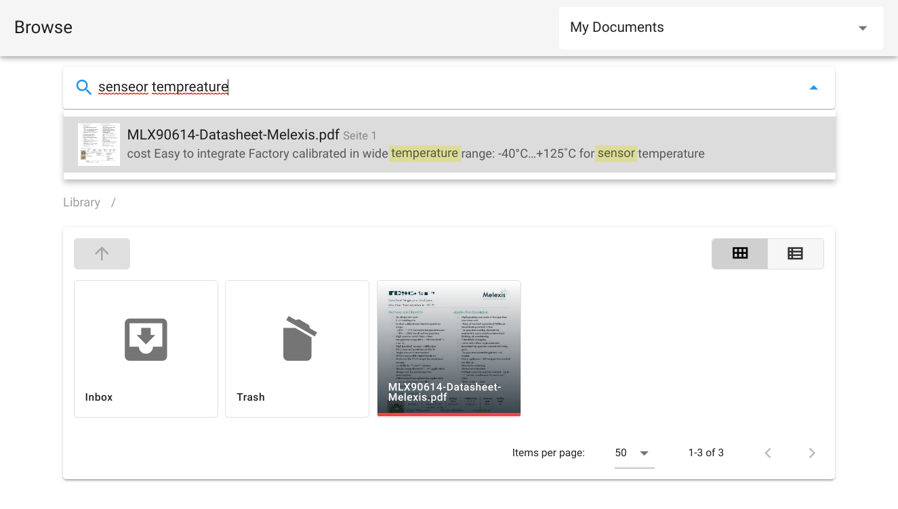

# Paperbase

Paperbase is an **open source document organizer** featuring **fulltext search**, **automatic OCR** for
scanned documents and **Import-by-Email** functionality (soon). It differs from many other document
management systems in that it lets you organize your documents **using plain file system directories**.
This prevents vendor lock-in and doesn't prevent other applications from accessing/editing files
(e.g. you could use it together with Nextcloud).

{.md-button}
