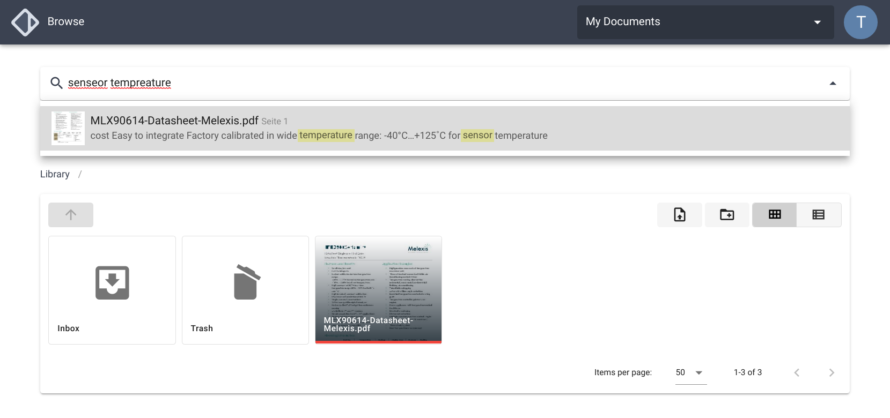

# Paperbase

Paperbase is an **open source document organizer** featuring **fulltext search**, **automatic OCR** for
scanned documents and **Import-by-Email** functionality (soon). It differs from many other document
management systems in that it lets you organize your documents **using plain file system directories**.
This prevents vendor lock-in and doesn't prevent other applications from accessing/editing files
(e.g. you could use it together with Nextcloud).

{.shadow}


## Install using Docker

Docker is the preferred and easiest way to set up your own Paperbase instance.


### Prerequisites

- [Docker](https://docs.docker.com/get-docker/)
- [Docker Compose](https://docs.docker.com/compose/install/)
- Ports 80 and 443 accessible (443 is optional if you don't need HTTPS e.g. in your local network)

!!! info
    The Docker Compose stack comes with the [Træfik](https://doc.traefik.io/traefik/) reverse proxy
    included and set up by default. It automatically generates certificates for HTTPS through
    Let's Encrypt. If you don't want HTTPS, or already have a running Teæfik instance, you need
    to edit `docker-compose.yml` accordingly.


### Setup

Download the production `docker-compose.yml` and `.env` files to an empty directory somewhere
on your server.

```sh
wget -O .env https://github.com/paperbaseapp/paperbase/blob/main/.env.prod.example
wget -O docker-compose.yml https://raw.githubusercontent.com/paperbaseapp/paperbase/main/docker-compose.prod.yml
```

1. In `.env`, set `MEILISEARCH_KEY`, `APP_KEY`, and `DB_PASSWORD` to random, 32 chars long strings.
2. Set `LETSENCRYPT_EMAIL` to the email address you want to use for Let's Encrypt
([see why](https://letsencrypt.org/docs/expiration-emails/)).
3. Set `PAPERBASE_DOMAIN` to the domain your instance will run on,
   or the IP address if running in your local network (make sure to disable HTTPS in that case).

Next, run `docker-compose up -d` to start the stack. After the stack has done booting, you should
be able to open Paperbase in your browser.

Finally, create a user by running the command `docker-compose exec app php artisan user:create`.


### Disabling HTTPS

To disable HTTPS, remove the according command arguments and port bindings in your
`docker-compose.yml` (see comments in that file).
